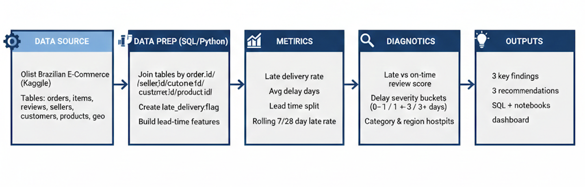

# E-commerce Delivery Performance & Customer Experience

**Delay Drivers and Customer Experience Impact Analysis**  
Olist Brazilian E-Commerce Public Dataset (~100k orders)

## 1. Background & Business Context
In the e-commerce industry, fulfillment capability is not just an operational cost—it is a core driver of customer retention. This project utilizes the **Olist Brazilian E-Commerce Dataset** (100k+ real orders) to analyze how delivery performance directly shapes customer experience. 
This analysis focuses on translating delivery performance signals into measurable, actionable operational metrics.

**Key Business Questions:**
1. **Satisfaction Correlation:** To what extent does delivery delay impact our average Review Scores?
2. **Bottleneck Diagnosis:** Is the delay caused by sellers (slow dispatch) or logistics partners (slow last-mile delivery)?
3. **Risk Distribution:** Which geographic regions or seller segments are the primary contributors to fulfillment failure?
4. **Early Warning Signals:** How can we establish operational metrics to detect logistics risks before negative reviews spike?

## 2. Data Source
* **Dataset:** Brazilian E-Commerce Public Dataset by Olist (available on Kaggle). 
* **Scale:** 100k+ orders (2016–2018).
* **Core Tables:** Orders, Order Items, Reviews, Sellers, Customers, Products, and Geolocation.
**Notes & Limitations**
- Historical data (pre-2018); patterns may not reflect recent infrastructure improvements.
- Repeat purchase rate is naturally low (~3–5%); analysis focuses on relative behavioral differences between on-time and late deliveries.

## 3. Key Metric Definitions
All metrics are computed at the order level unless otherwise specified.
The following metrics are defined to quantify performance:

| Metric | Definition / Formula | Business Value |
| :--- | :--- | :--- |
| **Late Delivery Rate** | # of Late Orders / Total Orders | Measures overall fulfillment reliability. |
| **Seller Prep Time** | `shipping_limit_date` - `purchase_time` | Evaluates seller warehouse efficiency. |
| **Carrier Lead Time** | `delivered_customer` - `delivered_carrier` | Measures third-party logistics (3PL) performance. |
| **Review Score Gap** | Avg. Score (On-time) - Avg. Score (Late) | Quantifies brand equity loss due to delays. |
| **Rolling Late Rate** | Late rate over the last 7 or 28 days | Acts as a proactive operational health indicator. |

## 4. Analysis Framework

### 4.1 Fulfillment Lead Time Decomposition
The order lifecycle is decomposed into three stages to pinpoint bottlenecks:
* **Stage 1: Order → Approval:** Time taken for payment clearance and fraud check.
* **Stage 2: Approval → Carrier (Seller Time):** Time taken by the seller to pick, pack, and hand over to the carrier.
* **Stage 3: Carrier → Customer (Logistics Time):** Time taken for the "last-mile" delivery.

### 4.2 Impact on Customer Experience
* **Score Decay:** Quantifying the correlation between days of delay and `review_score`.
* **Satisfaction Threshold:** Identifying the "breaking point" where customer dissatisfaction turns into 1-star reviews.
* **Repeat Purchase Proxy:** Analyzing the behavioral difference in future purchase intent between on-time and delayed customers.

### 4.3 Segment Analysis
* **Geospatial Analysis:** Using `geolocation` data to map late delivery hotspots across Brazilian states (e.g., SP vs. North regions).
* **Seller Tiering:**
  * **Tier A (Top):** On-time rate > 95%
  * **Tier C (High Risk):** On-time rate < 80% (targets for operational intervention)

## 5. Key Findings(draft)
Detailed quantitative results will be documented after metric validation and diagnostic analysis.

## 6. Business Recommendations(draft)
Recommendations will be refined based on finalized findings and robustness checks.

## 7. Project Structure
- `pipeline_diagram.png`  
  End-to-end workflow overview
- `/sql/`  
  SQL scripts for metric creation, delay flags, and rolling window analysis
- `/notebooks/`  
  Exploratory analysis and visualization of delivery performance and customer experience

## 8. Tools & Skills
* **Language:** Python (Pandas for cleaning, Matplotlib/Seaborn for visualization).
* **Analytics Skills:** Descriptive Statistics, Root Cause Analysis, Business Metric Design, Geospatial Analysis.

